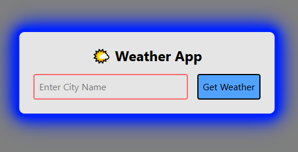
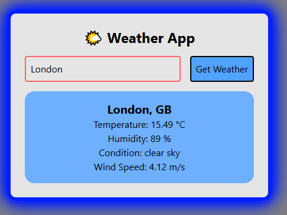

# 🌦️ React Weather App

A simple and responsive weather application built with **React.js**, powered by the **OpenWeather API**, styled using **TailwindCSS**, and enhanced with a **DotLoader spinner** for better user experience.

---

## Features

- 🌍 Search weather by **city name**.
- 📡 Fetches real-time weather data from **OpenWeather API**.
- 🌡️ Displays temperature, weather conditions, humidity, and wind speed.
- 🎨 Styled with **TailwindCSS** for a clean and responsive UI.
- ⏳ **DotLoader spinner** for smooth loading state handling.
- 📱 Fully responsive design.

---

## Tech Stack

- [React.js](https://reactjs.org/) – Frontend framework
- [TailwindCSS](https://tailwindcss.com/) – Styling
- [OpenWeather API](https://openweathermap.org/api) – Weather data provider
- [React Spinners](https://www.davidhu.io/react-spinners/) – DotLoader for loading animations

---

📸 Screenshots

   

## Project Structure

react-weather-app/
│── src/
│ ├── components/
│ │ ├── WeatherApp.jsx
│ ├── App.jsx
│ ├── index.js
│ ├── styles.css
│── public/
│── assets/
│ ├── weather_app_axios.png
│ ├──  weather_app_axios2.png
│── .env
│── package.json
│── tailwind.config.js
│── README.md

## Environment Variables

This project uses an API key from OpenWeather.
Make sure you configure the following in your .env file:

ini
Copy code
REACT_APP_WEATHER_API_KEY=your_api_key_here

## Acknowledgements

OpenWeather API

React Spinners

TailwindCSS

## License

This project is licensed under the MIT License – feel free to use and modify for your own projects.
